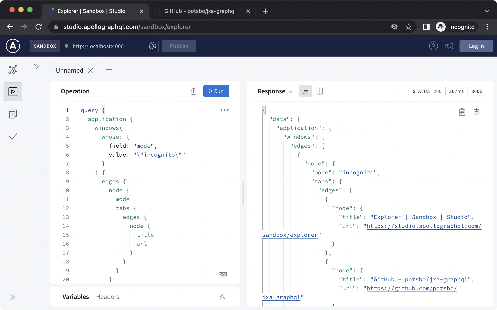

[](https://badge.fury.io/js/jxa-graphql)

[](https://codecov.io/gh/potsbo/jxa-graphql)
[](https://opensource.org/licenses/MIT)

# JXA GraphQL

Access AppleScript supported apps via GraphQL interface.



## Motivation

The motivation is easier software development with AppleScript supported apps.

### Performance - fetch only what we want

We have several obstacles to develop real world application with AppleScript.

- need to write long scripts to avoid N+1 problem
- need to write complex `whose` clauses

Because of these, we had to write a dedicated script for one task, which often becomes less reusable.
With JXA GraphQL, it becomes much easier to achieve fast AppleScript access.

<!-- TODO: Add some benchmark -->

### Safety - GraphQL as a boundary

In theory, it is possible to maintain performant generic reusable AppleScript/JXA code.
But in reality, because it lacks built-in type system and well written documents, it is not realistic to ensure the code works as expected.

It's been tried to introduce type safety to JXA.
As far as I'm aware of, [@jxa/sdef-to-dts](https://github.com/JXA-userland/JXA/tree/master/packages/%40jxa/sdef-to-dts) is the best example of this approach, which offers a great way to convert `sdef` files into TypeScript type definitions.
Although this library is very effective, because we have to pass JXA as string, we need to make sure that the JXA we are trying execute can be encoded into string, which can easily become tricky.
To address this issue, JXA GraphQL uses GraphQL as a strict but flexible boudary between application code and JXA code.

## Usage

### `serve`

`server` command starts a new GraphQL server.
With [`Apollo Sandbox`](https://studio.apollographql.com/sandbox/explorer), or any other preferred tools, you can run GraphQL queries to get data from applications.

```
$ npx jxa-graphql serve --help
jxa-graphql serve <appPath>

start a GraphQL server for the given Application

Positionals:
  appPath  Application path                                  [string] [required]

Options:
      --help     Show help                                             [boolean]
      --version  Show version number                                   [boolean]
  -p, --port     port number of the GraphQL server      [number] [default: 4000]
```

#### Example

```
$ npx jxa-graphql serve /Applications/Google\ Chrome.app
🚀  Server ready at http://localhost:4000/

# in another shell
$ curl 'http://localhost:4000/' \
  -H 'content-type: application/json' \
  --data-raw '{"query":"query { application { name } }","variables":{}}' | jq
  % Total    % Received % Xferd  Average Speed   Time    Time     Time  Current
                                 Dload  Upload   Total   Spent    Left  Speed
100   107  100    50  100    57    548    625 --:--:-- --:--:-- --:--:--  1371
{
  "data": {
    "application": {
      "name": "Google Chrome"
    }
  }
}
```

### `jxa-graphql` as a library

You can integrate `jxa-graphql` into any application.

#### Example

```ts
import { graphql } from "graphql";
import { makeExecutableSchema } from "@graphql-tools/schema";
import { runJXACode } from "@jxa/run";
import { buildRootValue, buildSchema } from "jxa-graphql";

(async () => {
  // build schema from AppleScript `sdef` file
  const typeDefs = await buildSchema("/Applications/Google Chrome.app");
  // build rootValue, which can compile GraphQL queries into jxa code
  const rootValue = buildRootValue("Google Chrome", runJXACode);
  const source = `
    query {
      application {
        name
      }
    }
  `;

  // compile typeDef and resolvers into executable schema
  const schema = makeExecutableSchema({ typeDefs, resolvers: { Query: rootValue } });

  // execute
  const { data } = await graphql({ schema, source });
  console.log(JSON.stringify(data)); // prints {"application":{"name":"Google Chrome"}}
})();
```

## Features

To be written

### Pagination

Because `jxa-graphql` implements [GraphQL Cursor Connections Specification](https://relay.dev/graphql/connections.htm), you can access only s

```graphql
query {
  application {
    windows(first: 42, after: 1234) {
      pageInfo {
        hasNextPage
        hasPreviousPage
        startCursor
        endCursor
      }
      edges {
        cursor
        node {
          name
        }
      }
    }
  }
}
```

### Fragment

To be written

### Inline Fragment

To be written

### Mutation (To be implemented)

To be written

### Enum

To be written

### Schema Override

To be written

### whose / byId

To be written

## How it works

JXA GraphQL is a GraphQL wrapper for [JavaScript for Automation (JXA)](https://developer.apple.com/library/archive/releasenotes/InterapplicationCommunication/RN-JavaScriptForAutomation/Articles/Introduction.html).

compile graphql query into javascript

```graphql
query {
  application {
    calendars(first: 3, whose: { field: "writable", value: "true" }) {
      edges {
        node {
          name
        }
      }
    }
  }
}
```

```js
function pascalCase(s) {
  return (s.match(/[a-zA-Z0-9]+/g) || []).map((w) => `${w[0].toUpperCase()}${w.slice(1)}`).join("");
}
function extractId(obj) {
  const spec = Automation.getDisplayString(obj);
  return (
    spec
      ?.split("byId")
      .reverse()[0]
      .match(/^\\(\"(.+)\"\\)$/)
      ?.reverse()[0] ?? null
  );
}
function paginate(nodes, { first, after }, getId) {
  const afterIndex = after === undefined ? undefined : nodes.findIndex((n) => getId(n) === after);
  if (afterIndex === -1) {
    return [];
  }
  const start = afterIndex === undefined ? 0 : afterIndex + 1;
  const end = first !== undefined ? start + first : undefined;
  return nodes.slice(start, end);
}
const app = Application("Calendar");
JSON.stringify({
  result: {
    calendars: (() => {
      const allNodes = app.calendars.whose({ writable: { _equals: true } })();
      const nodes = paginate(allNodes, { first: 3 }, extractId);
      return {
        edges: nodes.map((elm) => {
          return { node: { name: elm.name() } };
        }),
      };
    })(),
  },
});
```

## Development

- test first

## Release

When new tag pushed, GitHub Actions automatically create GitHub Releases and run `npm publish`

### Command to run

```
$ npm version <newversion>
$ git push origin <newversion>
```
